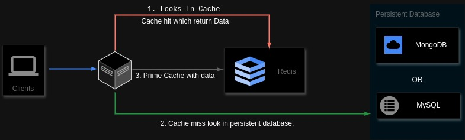

# Redis Cache
- [What is Redis Cache](#what-is-redis-cache)
- [How Radis cache works](#how-radis-cache-works)
- [Installation](#installation)
    - Windows
    - MacOs
    - Linux
- [How to use Redis](#how-to-use-redis)
- [Installing Redis Cache in Our Nodejs App](#installing-redis-cache-in-our-nodejs-app)
- [Working Redis Cache in Our Nodejs App](#working-redis-cache-in-our-nodejs-app)
- [Performance - before and after redis](#performance-before-and-after-redis)
- [Why use Redis Cache](#why-use-redis-cache)
- [Some common redis commands](#some-common-redis-commands)
## What is Redis Cache

Redis (REmote DIctionary Server) is an in-memory data structure store that is widely used as a caching mechanism due to its speed and flexibility. 

It is used to store data that needs to be accessed frequently and fast. It is not used for storing large amounts of data. If you want to store and retrieve large amounts of data you need to use a traditional database such as MongoDB or MYSQL. Redis provides a variety of data structures such as sets, strings, hashes, and lists.

Redis is a popular in-memory key-value database. Unlike traditional databases that run on a computer’s hard disk and store all of their data on disk, Redis runs inside of a system’s working memory (RAM). This allows Redis to be incredibly fast at fetching data, which is why it’s often used as a cache on top of other databases to improve application performance.

## How Radis cache works


Certainly! Let’s break down the working of Redis cache.

1. Clients make requests to the system. These clients could be applications, web browsers, or any other software that interacts with the system.

2. When a request comes in, the system first looks in the cache (Redis). This is represented by the arrow labeled “1. Looks In Cache” pointing from Clients to the black box labeled “Redis.”

3. If there is a cache hit, meaning the requested data is found in Redis, it returns the data directly to the Clients. The text inside the Redis box says, “Cache hit which returns Data.”

4. However, if there is a cache miss, indicating that the data is not found in Redis, the system then looks in the persistent database. In your image, two databases are depicted: MongoDB and MySQL (the blue boxes on the right side).

5. The system retrieves the data from the persistent database (either MongoDB or MySQL) and then primes (updates) Redis with this data. This ensures that future requests for the same data can be served directly from the cache, avoiding the need to hit the database again.

In summary:

- Redis acts as an in-memory cache, providing fast access to frequently requested data.
- If data is already in Redis (cache hit), it’s returned immediately.
- If not, the system fetches it from the persistent database and updates Redis for subsequent requests.

Remember that Redis is often used for caching frequently accessed data, improving system performance by reducing the load on the underlying databases. 😊

## How to use Redis Cache

### Installation

A. In Windows
Redis is not officially supported on Windows. However, you can install Redis on Windows for development by following the instructions below.

To install Redis on Windows, you'll first need to enable WSL2 (Windows Subsystem for Linux). WSL2 lets you run Linux binaries natively on Windows. For this method to work, you'll need to be running Windows 10 version 2004 and higher or Windows 11.

OR

You can watch YouTube video - CodeByHeart - By **Sayed Azhar Sabri**

[Click here - How to install Redis in windows](https://www.youtube.com/watch?v=CZ7E9Ga73bA&list=PLIfcYFqzDXHk1_3xdIhR0RzuwSGE4L6xW)

```bash
redis-cli 
127.0.0.1:6379> ping
PONG
```

B. How to install in Mac os
First, make sure you have Homebrew installed. From the terminal, run:

```bash
brew --version  
```

- If this command fails, you'll need to install [Homebrew](https://brew.sh/)

Installation - From the terminal, run:

```bash
brew install redis
```

This will install Redis on your system.

Starting and stopping Redis in the foreground

To test your Redis installation, you can run the redis-server executable from the command line:

```bash
redis-server
```

If successful, you'll see the startup logs for Redis, and Redis will be running in the foreground.

To stop Redis, enter Ctrl-C.

### Starting and stopping Redis using launchd

As an alternative to running Redis in the foreground, you can also use launchd to start the process in the background:

```bash
brew services start redis
```

You can check the status of a launchd managed Redis by running the following:
```bash
brew services info redis
```

If the service is running, you'll see output like the following:

```bash
redis (homebrew.mxcl.redis)
Running: ✔
Loaded: ✔
User: miranda
PID: 67975
```
To stop the service, run:
```bash
brew services stop redis
```

### Connect to Redis
Once Redis is running, you can test it by running redis-cli:
```bash
redis-cli
```
This will open the Redis REPL. Try running some commands:

```bash
127.0.0.1:6379> lpush demos redis-macOS-demo
OK
127.0.0.1:6379> rpop demos
"redis-macOS-demo"
```

C. How to install Redis on Linux
Most major Linux distributions provide packages for Redis.

Install on Ubuntu/Debian

1. Update APT Repository
Redis is already included in the official package repository of Ubuntu. Nevertheless, we recommend to frequently update the APT repository to get the latest version possible.

```bash
sudo apt-get update
```
2. Install Redis Server on Ubuntu Using the APT Command

```bash
sudo apt install redis
```
Press “y” and then hit Enter to continue.

3. Check the Redis Version

Once Redis is installed, you can check if the installation was successful by using this command:

```bash
redis-cli --version
```
The output will display the version of the Redis server currently installed on your machine.

4. Start Redis Service

Once the installation is complete, we recommend checking if the Redis instance is running. In order to test connectivity, you can use the following command:
```bash        
sudo systemctl status redis
```
5. Then, log in to the Redis command-line client:
```bash
redis-cli
```

#### Working - How to set and get data in redis

> SET Key Value

> GET key

```bash
user@aasif-iqbal:~$ redis-cli
127.0.0.1:6379> SET blog_data "title:How to work with redis"
OK
127.0.0.1:6379> GET blog_data
"title:How to work with redis"
```

> [!NOTE] 
> Note: We Don't Need Redis cache to be installed in our local machine to work with nodejs app. In nodejs app, we simply use npm install redis, to install and use it in our application.

## Installing Redis Cache in Our Nodejs App

Open terminal:
```bash
npm install redis
```

```bash
npm install @types/redis
```

## Working Redis Cache in Our Nodejs App

> In app.ts

1. Create Connection

```js
import * as redis from "redis";

let redisClient;

(async () => {
  redisClient = redis.createClient();

  redisClient.on("error", (error) => console.error(`Error : ${error}`));

  await redisClient.connect();
})();
```
2. How to set and get data using redis cache in Nodejs App

```js
const _createRedisClient = async () => {
  
  const client = await redis.createClient();
  
  client.on('error', (err) => {
      console.error('Redis connection error:', err);
  });
  // Additional initialization or setup logic can go here
  return client;
}

const getQuiz: RequestHandler = async (req, res, next) => {
 
 let quiz;
 
 try { 
    const redisClient = await _createRedisClient();
        
        await redisClient.connect();
        
        //get data from cache-memory
        let redisCache = await redisClient.get(JSON.stringify('my_key'));            
    
        if(redisCache !== null){
            // fetch from redis-cache
           return quiz = JSON.parse(redisCache);            
        } else {        
            // if cache is null(missing) - Fetch from database
            quiz = await Quiz.find({});
            
            // set quiz data in redis cache with unique key
            await redisClient.set(JSON.stringify('my_key'), JSON.stringify(quiz));      

            return quiz;
        }        
    } catch(err){
        next(error);
    } 
}
```

> [!NOTE] 
> Note: Make Sure, After every Operations(such as Create, update, delete) We need to ERASE the cache-memory, So that we get updated cache value.

## Performance - before and after using Redis
A. Without using Redis Cache


B. After Using Redis Cache


## Why use Redis Cache

Redis cache can be used in your application to improve performance and reduce the load on your primary data store (such as a database or an API). Here are some common scenarios where Redis cache can be beneficial:

- Frequent Read Operations: If your application frequently reads data that doesn't change often, you can cache the results in Redis. This reduces the need to fetch the data from the primary data store every time, improving response times and reducing latency.

- Highly Accessed Data: Caching frequently accessed data in Redis helps reduce the load on your primary data store and can improve overall system performance. This is especially useful for data that is accessed by many users simultaneously.

- Session Management: Storing session data in Redis allows you to easily scale your application across multiple servers or instances. Redis provides fast read and write operations, making it ideal for storing session information.

- API Response Caching: If your application consumes data from external APIs, you can cache the responses in Redis to reduce latency and improve performance. This is particularly useful for APIs that have rate limits or slow response times.

- Result Caching: Cache the results of expensive calculations or complex operations to avoid repeating the same computations. This can significantly improve the performance of your application, especially for CPU-intensive tasks.

Overall, Redis cache can be used in various parts of your application to improve performance, scalability, and reliability. It's important to identify the specific use cases and requirements of your application and determine where Redis caching can provide the most benefit.

## Some common redis commands

| Commands                    	| Usage                                           	|
|-----------------------------	|-------------------------------------------------	|
| redis-cli                   	| To start redis in terminal                      	|
| AUTH YourPassword           	| Set Password Authentication                     	|
| SET Key Value               	| Set the value of a key.                         	|
| GET Key                     	| Get the value of a key.                         	|
| EXISTS Key                  	| Check if a key exists                           	|
| LPUSH key value [value ...] 	| Insert one or more values at the head of a list 	|
| RPUSH key value [value ...] 	| Insert one or more values at the tail of a list 	|
| LPOP key                    	| Remove and return the first element of a list   	|
| RPOP key                    	| Remove and return the last element of a list    	|
| KEYS *                      	| Get all keys                                    	|
| DEL key[key ...]            	| Delete one or more keys.                        	|
| FLUSHALL                    	| Delete all keys from all databases.             	|